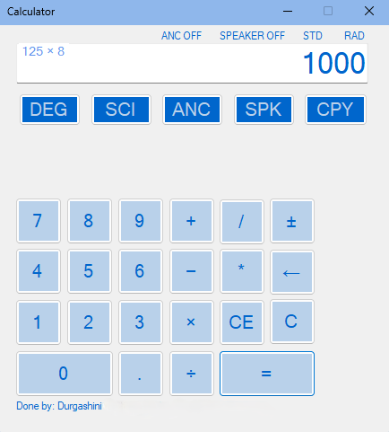
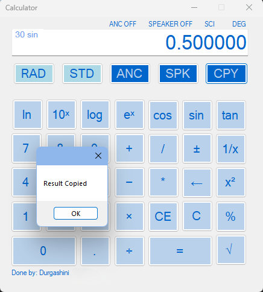

# Scientific Calculator Desktop Application — C# WinForms

A desktop scientific calculator developed using **C# and .NET WinForms**.  
The application supports standard and scientific calculations together with keyboard input, degree/radian trigonometric calculations, speech synthesis, audio feedback, and result-copying features.

This project was developed as part of my diploma coursework and focuses on **event-driven programming, GUI development, user interaction, and desktop application design**.

---

## Features

- Standard arithmetic operations:
  - Addition
  - Subtraction
  - Multiplication
  - Division
  - Modulus

- Scientific functions:
  - Square root
  - Square
  - Reciprocal
  - Base-10 logarithm
  - Natural logarithm
  - `10^x`
  - `e^x`
  - Sine
  - Cosine
  - Tangent

- Switchable **Standard** and **Scientific** calculator modes

- Switchable **Degree (DEG)** and **Radian (RAD)** modes for trigonometric calculations

- Physical keyboard input support for:
  - Numbers
  - Addition
  - Subtraction
  - Multiplication
  - Division
  - Decimal input
  - Equals

- Speech synthesis for reading calculation results aloud

- Optional button sound feedback

- Copy calculated results directly to the clipboard

- Equation display showing the current calculation

- Additional controls including:
  - Backspace
  - Clear
  - Clear Entry
  - Positive/negative sign conversion
  - Decimal input validation

---

## Application Preview

### Standard Mode



The standard calculator interface supports common arithmetic operations while displaying both the current equation and calculated result.

### Scientific Mode and Result Copying



Scientific mode provides additional mathematical functions including logarithmic, exponential, reciprocal, square-root and trigonometric calculations.  
The example above shows a degree-mode calculation of `sin(30°) = 0.500000` together with the result-copying feature.

---

## Technical Implementation

The application was developed using an **event-driven WinForms architecture**, where calculator buttons and keyboard inputs trigger corresponding event handlers.

### Calculation Handling

Arithmetic and scientific operations are processed using C# mathematical functions and operation-specific logic.

Scientific calculations include:

- `Math.Sqrt()`
- `Math.Pow()`
- `Math.Log10()`
- `Math.Log()`
- `Math.Exp()`
- `Math.Sin()`
- `Math.Cos()`
- `Math.Tan()`

For trigonometric operations, degree inputs are converted to radians before calculation when **DEG mode** is selected.

## GUI Modes

The calculator supports two interface modes:

- **Standard Mode** — displays core arithmetic controls
- **Scientific Mode** — reveals additional scientific-function controls

The interface dynamically shows or hides scientific buttons depending on the selected mode.

### Keyboard Input

Keyboard events are mapped to calculator controls using WinForms key-event handling.  
For example, pressing numerical or arithmetic keys triggers the same button events as clicking the corresponding GUI controls.

### Speech and Audio Features

The application uses:

```text
System.Speech.Synthesis
```
to provide optional text-to-speech output for calculated results.
System sound feedback can also be enabled for user interactions.
Clipboard Support
Calculated results can be copied directly using: Clipboard.SetText() with a confirmation message displayed after copying.

## Technologies Used
- C#
- .NET Framework 4.8
- Windows Forms (WinForms)
- Visual Studio
- System.Speech
- System.Windows.Forms
- Event-driven programming
- Object-oriented programming
- GUI development

## Project Structure
```text
scientific-calculator-csharp-winforms/
│
├── Calculator_212017P.sln
├── Calculator_212017P/
│   ├── App.config
│   ├── Calculator_212017P.csproj
│   ├── Mainform_212017P.cs
│   ├── Mainform_212017P.Designer.cs
│   ├── Mainform_212017P.resx
│   ├── Program.cs
│   └── Properties/
│
├── images/
│   ├── standard-mode.png
│   └── scientific-copy-result.png
│
├── .gitignore
└── README.md
```
## How to Run
Requirements
- Windows
- Visual Studio
- .NET Framework 4.8
Steps
1. Clone this repository:
git clone https://github.com/durgashini-sit/scientific-calculator-csharp-winforms.git

2. Open:
Calculator_212017P.sln

3. Build the solution in Visual Studio.
4. Run the application using:
F5 or select Start in Visual Studio.

## Skills Demonstrated
- C# programming
- .NET WinForms development
- Event-driven programming
- GUI design and development
- Object-oriented programming
- Keyboard-event handling
- Mathematical function implementation
- Speech synthesis integration
- Clipboard interaction
- User-interface state management
- Debugging and software testing

## Academic Context
This project was originally developed during my Diploma in Electronic & Computer Engineering at Nanyang Polytechnic and was later organized  for portfolio presentation.
The project provided practical experience in developing an interactive desktop application and implementing event-driven GUI functionality using C# and .NET WinForms.
